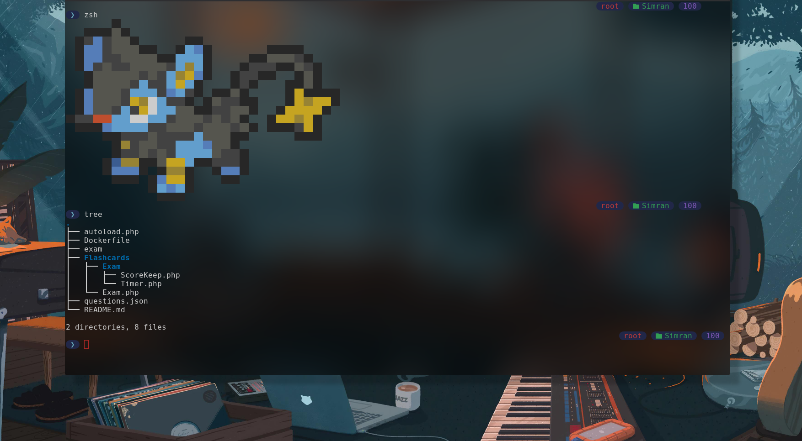
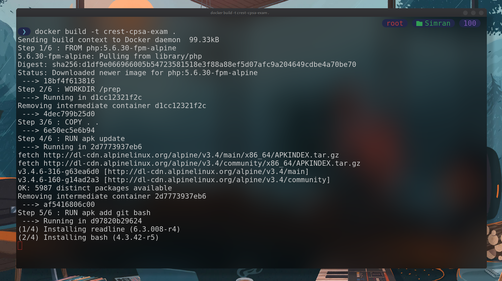
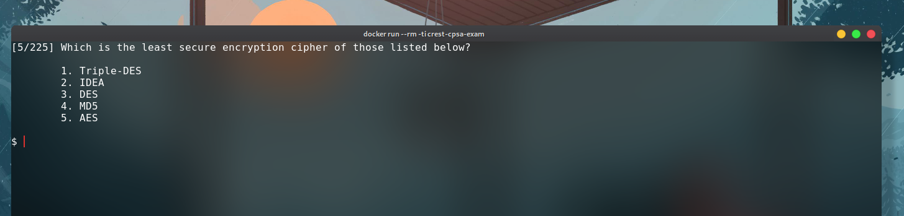

<div style="display:flex; justify-content:center;"><img align="left" src="https://www.crest-approved.org/wp-content/uploads/2022/04/Crest-logo-Refresh_2022_CMYK_2_AW_col-no-reg-TM-scaled.jpg" border="

  
# CREST-CPSA-Terminal-Based-Practice-Question-Prep
  
a mini php application running docker container which supports simulation of questions from a json file in cli with real time correct/wrong answer prompt

  

### Folder Structure

2 directories, 8 files

## Build
```bash
$ docker build -t crest-cpsa-exam .
```


## Run & Deploy
```
$ docker run --rm -ti crest-cpsa-exam
```

## yay it works !! 🥳



## Modify Exam question count

Individual tests can be generated like this:

```bash
# Unset for individual set of 120 questions
CMD ["/usr/local/bin/php","-f","exam","crest-cpsa-exam.json","120"]
```
